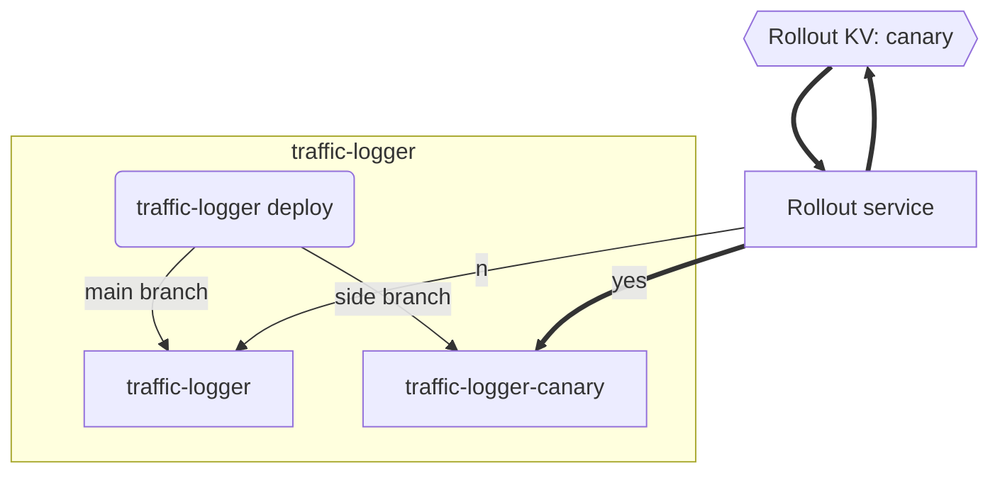

# Rollout

This service is responsible for rolling out new versions of the application according to the rollout value in KV "rollout"

According to the value in KV and a random number between 1-100, this service will relay the traffic to either "traffic-logger" or "traffic-logger-canary" service.

