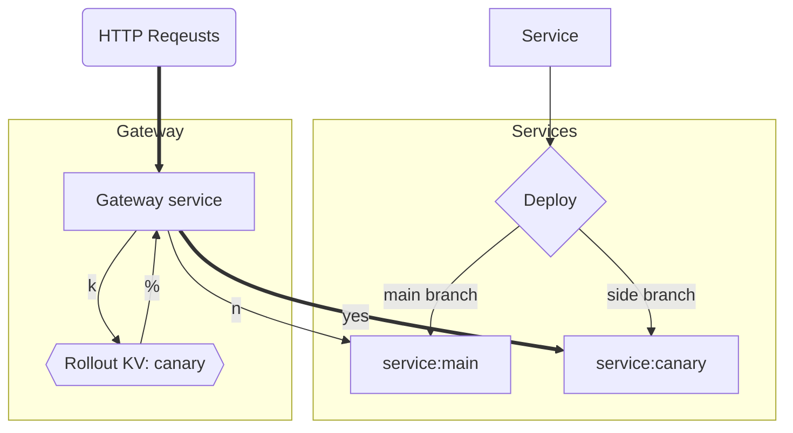

# traffic logger

Send traffic logs to logs.io for each request

## Side effects

- Add request ID to each request
- Cache everything for 600 seconds \*TBC
- Add some response headers for browser security and observability
- Add server timing and caching headers

# Deploy strategy

- `main` branch is deployed to `traffic-logger`
- side branches is deployed to `traffic-logger-canary`

# Gateway

This service is responsible for rolling out new versions of the application according to the rollout value in KV "rollout"

According to the value in KV and a random number between 1-100, this service will relay the traffic to either "traffic-logger" or "traffic-logger-canary" service.

